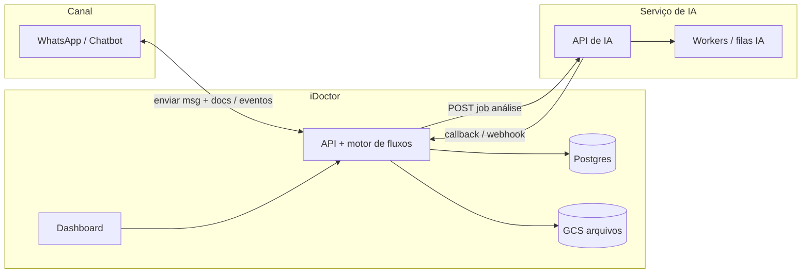

# Escopo do produto — iDoctor (painel + orquestração de fluxos)

Este documento define **o que o projeto iDoctor faz**, em contraste com o **assistente WhatsApp/chatbot** e o **serviço de IA** (análise de exames, análise TD, etc.), que ficam **fora** deste repositório.  
Inclui **fases de produto** (para alinhar ao PDF *Fases Do Produto – Assistente Whats App E Painel Interno…*), **integrações** e **layout do dashboard** (menu lateral fixo + conteúdo à direita).

> **Nota:** o PDF não está versionado neste repositório. Quando você adicionar o arquivo em `docs/`, vale **revisar** as fases abaixo e marcar divergências com checkboxes.

---

## 1. Visão em uma frase

O **iDoctor** é o **painel interno multi-tenant** onde cada **clínica (tenant)** define a **jornada do paciente** (passo a passo do tratamento), a equipe **move o paciente entre etapas**, o sistema **grava o estado** e **monta o payload** do pacote documental para o chatbot (mensagem + documentos). Também prepara a base para **orquestrar chamadas à IA** (análise de exames, TD, etc.) quando uma etapa exige isso. O **WhatsApp** e a **inferência de IA** são **projetos separados**; aqui ficam **regras, cadastro, jornada, armazenamento e integrações**.

---

## 2. Fronteiras entre sistemas (responsabilidades)

| Sistema | Responsabilidade | O que **não** faz no escopo “outro projeto” |
|--------|-------------------|-----------------------------------------------|
| **Projeto WhatsApp / chatbot** | Conversa no canal WhatsApp, NLP de triagem, handoff, mensagens de mídia no canal | Persistência do painel, regras de negócio clínicas completas, editor de fluxo visual |
| **Projeto IA (análise)** | Interpretar exames, TD, textos, imagens; retornar laudos, scores, flags ou JSON estruturado | CRUD do painel, multi-tenant, filas de negócio do tenant |
| **iDoctor (este repo)** | Tenants, usuários, **modelo de jornada** (etapas do paciente por clínica), **estado do paciente na jornada**, **documentos por etapa**, disparo ao **chatbot**, **runs** / eventos, **armazenamento** (GCS), **chamar IA** e **callbacks**, **dashboard** | Modelo de IA, canal WhatsApp em si |

### 2.1 Diagrama lógico

---

## 3. O que o iDoctor pode fazer (lista detalhada)

### 3.1 Jornada do paciente (fluxo clínico por tenant)

A **orquestração** vive neste sistema: ela define o **passo a passo do paciente com a clínica**, não o desenho técnico do chatbot.

#### Ordem operacional no painel (cadastro → fluxo → etapas)

Fluxo canônico em **três momentos** (sempre nessa ordem lógica):

| Passo | O que acontece | Detalhe |
|-------|----------------|---------|
| **1. Cadastrar o paciente** | Registro do **Cliente/Paciente** no tenant | Dados mínimos atuais do produto/código: **nome**, **telefone WhatsApp**, **documento** e **descrição do caso**; opcionalmente e-mail, responsável, OPME e outros campos que a clínica definir. Ainda **não** há fluxo de jornada vinculado — só ficha. |
| **2. Escolher o fluxo** | Associar o paciente a um **`CarePathway`** (versão publicada) | Cria-se o **`PatientPathway`**: `pathwayId` + primeira etapa (`currentStageId`). Se o tenant tiver **vários** fluxos → **escolha explícita**; se **só um** → sistema **define automaticamente** esse fluxo. Ao **entrar** na primeira etapa, vale a **regra do pacote**: envio ao WhatsApp dos documentos da etapa (se houver). |
| **3. Avançar no fluxo** | **Transição de etapa** (`TransitionPatientStage`) | A equipe **move** o paciente para a **próxima etapa** (ou etapa específica) no painel. Cada mudança **persiste** transição, gera **snapshot do pacote** de documentos da etapa de **destino** para o canal e prepara a futura integração de dispatch/IA. |

O passo 3 pode repetir **várias vezes** até o fim do tratamento ou arquivamento do caso.

#### Assistente (wizard) no cadastro inicial

A equipe pode usar um **fluxo em etapas na mesma tela** (wizard / stepper), em vez de telas totalmente separadas:

| Etapa do wizard | Conteúdo |
|-----------------|----------|
| **1 — Dados do paciente** | Nome, WhatsApp, descrição do caso, demais campos; navegação **“Próximo”**. |
| **2 — Fluxo** | Escolha do **`CarePathway`** (lista ou cards). Se o tenant tiver **apenas um** fluxo publicado, esta etapa pode ser **omitida** ou exibida já **pré-selecionada** com confirmação rápida. |
| **3 — Concluir** | Ação **“Salvar”** / **“Finalizar”** que **persiste tudo**: cria o **`Client`** e em seguida o **`PatientPathway`** (primeira etapa + regras de disparo ao entrar na etapa). |

- O estado intermediário pode ficar no **estado do cliente** (React) até o submit final; opcionalmente **rascunho** no servidor (futuro) se precisar recuperar sessão.
- **Implementação da API:** um único endpoint transacional (ex.: `POST /api/v1/patients/onboard` com dados + `pathwayId`) **ou** duas chamadas sequenciais (`POST /clients` → `POST .../pathway`) disparadas **só** ao concluir o wizard — evitar gravar paciente “órfão” sem fluxo se o produto exigir os dois juntos.

#### Fluxos padrão, múltiplos fluxos e editor visual

- **Templates padrão** — A plataforma oferece **jornadas modelo** (ex.: a sequência *Consulta inicial → Realizar exames → Exames pré-cirúrgicos → Cirurgia → Medicamentos pós-cirúrgicos*). O tenant pode **criar** um fluxo a partir desse modelo ou do zero.
- **Vários fluxos por clínica** — Cada **tenant** pode ter **mais de um** `CarePathway` (ex.: “Cirurgia bariátrica”, “Acompanhamento dermatológico”). Cada fluxo tem nome identificável.
- **Edição com `@xyflow/react` (React Flow)** — O tenant **altera** o fluxo **adicionando ou removendo etapas** no canvas visual; o estado do editor (**nodes** + **edges** + metadados) é **persistido no banco** (JSON compatível com React Flow), junto com a **materialização** das etapas para regras de negócio (`PathwayStage`, documentos, ordem).
- **Início da jornada no paciente** — Ao **associar** um paciente a uma jornada (`PatientPathway`):
  - Se o tenant tiver **mais de um** fluxo publicado → a UI obriga **escolher qual fluxo** usar.
  - Se existir **apenas um** fluxo → o sistema **associa automaticamente** esse fluxo, **sem** tela de escolha.

**Conceitos:**

| Conceito | Descrição |
|----------|-----------|
| **Modelo de jornada** (`CarePathway`) | Pertence a **um tenant**. Pode haver **vários** por clínica. Pode nascer de **template** padrão da plataforma ou ser criado do zero. |
| **Versão publicada** (`PathwayVersion`) | Contém o **grafo** salvo do React Flow + etapas derivadas para documentos e transições. |
| **Etapa** | Um passo com **nome**, **ordem** (ou posição no grafo), texto ao paciente, **anexos**. |
| **Documentos na etapa** | Na **criação/edição** da jornada, a clínica **associa arquivos** à etapa (PDFs, termos, pedidos de exame). |
| **Checklist na etapa** | Na **criação/edição** da jornada, a clínica define itens operacionais da etapa; no detalhe do paciente, a equipe marca o progresso apenas da **etapa atual**. |
| **Regra de envio ao entrar na etapa** | Sempre que o paciente **passa a estar** numa etapa, recebe **todos** os documentos **daquela** etapa (pacote integral). |
| **Instância por paciente** | `PatientPathway`: **qual fluxo** (`pathwayId`), **versão**, **etapa atual** (`currentStageId`), histórico de transições. |

**Exemplo de copy para o paciente (etapa 2 — exames):**

> Você foi movido para a **etapa 2**. O assistente vai te enviar **todos** os documentos e orientações dessa fase — por exemplo, a lista completa de **exames que você precisa marcar** e os pedidos em PDF.

A clínica configura na etapa “Realizar exames” **todos** os PDFs/instruções necessários; ao **entrar** nessa etapa, o payload para o WhatsApp inclui **`documents[]`** com **100% dos arquivos** vinculados à etapa naquele momento (versão publicada da jornada).

**Exemplo (mesma ideia do Anderson):**

1. Consulta inicial  
2. Realizar exames  
3. Exames pré-cirúrgicos  
4. Cirurgia  
5. Medicamentos pós-cirúrgicos  

Isso é **uma jornada**; no painel, o médico/atendente **posiciona o paciente** na etapa correta (ex.: “passou na consulta, mandar para realizar exames”).

**O que ocorre em cada transição de etapa (passo 3 acima):**

1. Médico ou equipe **altera a etapa** do paciente no painel (select da próxima etapa, botão “Avançar”, etc.).  
2. O iDoctor **persiste** a nova etapa + auditoria (`userId`, timestamp).  
3. O sistema **monta o evento** para o projeto WhatsApp: `patient.stage_changed`, `tenantId`, `patientId`, `stageId`, **texto da mensagem**, **`documents[]` completo** da etapa de destino.  
4. No estado atual do código, esse payload fica persistido como **`dispatchStub`**; a entrega real ao canal continua como integração evolutiva.

**Caso “iniciou tratamento e precisa assinar documentos”:**

- A etapa **“Consentimentos / documentos iniciais”** (ou o nome que a clínica der) tem os **PDFs** vinculados na definição da jornada.  
- Ao **mover** o paciente para essa etapa, dispara-se o mesmo pipeline: gravação + **disparo ao chatbot** com os docs dessa etapa.

### 3.2 Orquestração técnica (motor interno)

| Capacidade | Descrição |
|------------|-----------|
| **Persistência do canvas** | JSON **React Flow** (`nodes`, `edges`, opcional `viewport`) em `PathwayVersion` (ou tabela dedicada), alinhado ao pacote **`@xyflow/react`**. |
| **Etapas materializadas** | Tabela `PathwayStage` (ou equivalente) para ordem, documentos e FK de `PatientPathway.currentStageId` — **sincronizada** ao salvar o editor (ou derivada do grafo com regras claras). |
| **Templates** | Registros de **jornada padrão** (plataforma) clonáveis para um tenant; após clonar, o tenant edita no XYFlow como qualquer outro fluxo. |
| **Publicar versões** | Rascunho vs publicado; pacientes em tratamento podem ficar presos à versão (política explícita). |
| **Transição = evento** | Mesma regra: WhatsApp, IA ou ambos. |
| **Idempotência no disparo** | Mesma regra de correlação e retry. |

### 3.3 Integração com o projeto de IA

| Ação | Comportamento sugerido |
|------|----------------------|
| **Disparar análise** | Evolução futura: `POST` para a API de IA com `tenantId`, `patientId` ou `runId`, `stageId`, `tipo` (`exam_analysis`, `td_analysis`, …), `input` (URLs do GCS, texto). |
| **Autenticação** | API key ou mTLS; `tenantId` sempre no payload. |
| **Resposta assíncrona** | Planejado: IA retorna `202` + `jobId`; o painel grava status ligado ao paciente/etapa. |
| **Callback** | Planejado: `POST /api/v1/webhooks/ai` com `jobId`, `status`, `result` ou erro. |
| **Idempotência** | Planejado na integração real. |

### 3.4 Integração com o projeto WhatsApp (saída)

| Ação | Comportamento sugerido |
|------|----------------------|
| **Saída principal** | Ao **mudar de etapa**, o painel monta e persiste o payload que chamará a **API do chatbot** com: texto introdutório, **`documents[]` completo** (todos os arquivos da etapa de destino), `patient` + `tenant`. |
| **Entrada** | Webhook do chatbot → iDoctor quando o paciente **responde**, **assina** ou **envia arquivo**; atualiza status da etapa ou anexa à ficha (contrato em `docs/integrations/whatsapp.md`). |

### 3.5 Dados e painel clínico

| Capacidade | Descrição |
|------------|-----------|
| **Cadastro de paciente/cliente** | **WhatsApp** (telefone do canal), **nome**, **descrição do caso** / resumo clínico; demais campos opcionais (documento, endereço) — por tenant. Cadastro **antes** de vincular fluxo (passo 1 da ordem operacional). |
| **Arquivos** | Documentos da **biblioteca da clínica** e os **vinculados a cada etapa** da jornada; exames no GCS para IA. |
| **Ficha do paciente** | Etapa atual, checklist da etapa atual, **anotações dedicadas**, histórico de etapas, timeline de transições, arquivos, responsável, OPME e snapshot do pacote documental por etapa. |
| **Auditoria** | Quem moveu o paciente de etapa, disparos ao canal e jobs de IA. |

---

## 4. Layout do dashboard: menu lateral fixo + conteúdo à direita

### 4.1 Estrutura de UI

- **Coluna esquerda (fixa):** largura estável (ex.: `w-64` / 256px), `shrink-0`, scroll só se muitos itens; **logo**, **tenant switcher** (se aplicável), **navegação**, **rodapé** (usuário, versão, sair).
- **Bloco direito:** `flex-1`, `min-w-0`, padding consistente; **título da página** + **conteúdo** (tabelas, cards, editor de fluxo em tela cheia dentro desta área).
- **Responsivo:** em mobile, sidebar vira **drawer** (sheet) com hamburger; mesma árvore de rotas.

### 4.2 Itens de menu sugeridos (avaliação clínica + operação)

Ordem típica de leitura; nomes podem ser ajustados ao produto final.

| Item | Rota exemplo | Conteúdo à direita |
|------|--------------|-------------------|
| **Início** | `/dashboard` | KPIs, filas “aguardando IA”, alertas, atalhos. |
| **Pacientes / Clientes** | `/dashboard/clients` | Lista, busca, **ficha** com etapa e histórico. |
| **Novo paciente** | `/dashboard/clients/new` (ou modal wizard) | **Wizard:** dados → escolha do fluxo → **Salvar** (Client + PatientPathway). |
| **Jornadas** | `/dashboard/pathways` | Lista de **fluxos** da clínica; criar a partir de **template** padrão ou do zero; vários fluxos lado a lado. |
| **Editor de jornada** | `/dashboard/pathways/[id]` | Canvas **@xyflow/react**: adicionar/remover etapas (nodes), salvar grafo no backend; painel por etapa: PDFs, texto, flags IA. |
| **Atendimentos / fila** | `/dashboard/runs` (ou `/dashboard/instances`) | Pacientes “em acompanhamento”, filtros por etapa (opcional). |
| **Detalhe / timeline** | `/dashboard/patients/[id]` ou run | Transições, envios ao WhatsApp, jobs de IA, erros. |
| **Análises IA** (opcional) | `/dashboard/ai-jobs` | Lista de jobs de IA por tenant (debug/acompanhamento). |
| **Arquivos** | `/dashboard/files` | Biblioteca por tenant/cliente. |
| **Relatórios** | `/dashboard/reports` | Gráficos (volume, SLA, taxa de erro IA). |
| **Configurações** | `/dashboard/settings` | Perfil, clínica, notificações, equipe, OPME, fases do tratamento e placeholders de integrações; para `super_admin`, também concentra a gestão básica de tenants. |
| **Admin** (só super admin) | `/admin/tenants` | Gestão de tenants. |

### 4.3 Padrões visuais (shadcn)

- **Sidebar:** componente `Sidebar` (ou `NavigationMenu` vertical) com `aria-current` na rota ativa.
- **Conteúdo:** `PageHeader` (título + breadcrumb + ações primárias) + `Card` / `DataTable`.

---

## 5. Fases do produto (proposta para alinhar ao PDF)

Use esta tabela como **checklist**; ao importar o PDF, marque **OK** ou **ajustar** em cada linha.

### Fase 0 — Fundações

| Entrega | Detalhe |
|---------|---------|
| Monorepo Next + Postgres + Prisma | Tenants, users, memberships, refresh tokens. |
| Auth JWT + papéis | Super admin, tenant admin, tenant user. |
| Layout dashboard | Sidebar fixa + área principal; tema shadcn. |

### Fase 1 — Cadastro e arquivos

| Entrega | Detalhe |
|---------|---------|
| CRUD clientes/pacientes | Campos acordados (nome, doc, telefone, endereço). |
| GCS | Upload, metadados, URLs assinadas para a IA. |

### Fase 2 — Jornada do paciente + disparo ao chatbot (MVP)

| Entrega | Detalhe |
|---------|---------|
| Modelo de jornada por tenant | Etapas ordenadas (ex.: consulta → exames → cirurgia); nome + ordem. |
| Documentos por etapa | Upload/biblioteca + vínculo na etapa; payload para API do chatbot. |
| Mudança de etapa na ficha | Médico/equipe altera etapa; persistência + **evento de disparo** ao WhatsApp (stub até integrar). |
| Versão publicada | Rascunho vs publicado da jornada (reuso do conceito de workflow). |
| Callback IA (opcional no MVP) | Webhook para simular retorno de análise em etapa “com IA”. |

### Fase 3 — Integração IA (contrato)

| Entrega | Detalhe |
|---------|---------|
| Cliente HTTP `AiClient` | `dispatchJob`, `parseCallback`. |
| Tabela `AiJob` | `correlationId`, `runId`, `status`, `payload`. |
| Nó “Chamar IA” + “Aguardar resultado” | Fluxo pausa e retoma após callback. |

### Fase 4 — Integração WhatsApp (outro projeto)

| Entrega | Detalhe |
|---------|---------|
| API de eventos | Receber eventos do chatbot (IDs mapeados). |
| Ação “Notificar WhatsApp” | Chamar API do projeto de canal. |

### Fase 5 — Operação e visão clínica

| Entrega | Detalhe |
|---------|---------|
| Telas de resultado | Exibir outputs estruturados da IA na ficha do paciente/run. |
| Relatórios | Gráficos operacionais. |
| Auditoria | Logs de super admin e jobs IA. |

---

## 6. Riscos e decisões

| Tema | Recomendação |
|------|--------------|
| **Acoplamento** | Contratos versionados (`/v1`) entre iDoctor ↔ IA ↔ WhatsApp; não compartilhar código de domínio, só DTOs. |
| **SLA da IA** | Timeouts e estados `failed` no run; retentativa com política clara. |
| **LGPD** | Dados sensíveis em trânsito (HTTPS) e em repouso; minimizar logs com PII. |

---

## 7. Documentos relacionados

- [ARCHITECTURE.md](./ARCHITECTURE.md) — arquitetura técnica, multi-tenant, subdomínios, auth; **§8** modelo de dados (pathway, transição, dispatch) e impacto no código.
- *PDF* — coloque em `docs/` e referencie aqui o nome do arquivo para reconciliação das fases.

---

*Escopo: painel interno + **jornada do paciente por tenant** (etapas, documentos, disparo ao chatbot); WhatsApp e IA como sistemas externos.*
