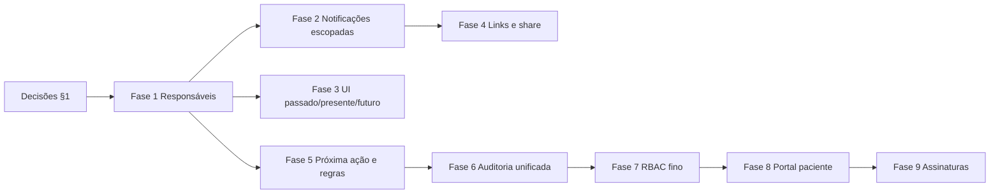

# Plano de ação — alinhamento às transcrições (Bucomax)

Documento operacional para **sequenciar entregas** após as reuniões e mensagens consolidadas em [`meeting-presentation-gap-analysis.md`](./meeting-presentation-gap-analysis.md). Complementa [`execution-plan.md`](./execution-plan.md) (fases já entregues e **integrações congeladas**).

---

## 0. Como usar este plano

| Elemento | Significado |
|----------|-------------|
| **Fase** | Pacote de trabalho com objetivo de produto testável. |
| **Depende de** | Bloqueadores — não iniciar sem resolver. |
| **Entrega** | O que precisa existir para considerar a fase “feita”. |
| **Tarefas técnicas** | Direção para o time (arquivos/camadas típicas). |
| **Critérios de aceite** | Verificação objetiva. |

**Regra de ouro:** integrações **WhatsApp real**, **e-mail transacional ao paciente em massa** e **provedor de assinatura** ficam em **trilha paralela** até decisão explícita (ver `execution-plan.md`). O plano abaixo **prepara dados e UI** para plugar esses canais depois.

---

## 1. Decisões de produto antes de codar (checklist)

Resolver com stakeholders **uma vez**; desbloqueia Fases 1–3.

1. **Responsável por etapa** — modelo preferido: (a) só `PatientPathway.currentStageAssigneeUserId` + histórico em `StageTransition`, ou (b) tabela **`PatientStageAssignment`** (uma linha por “entrada na etapa” com `assigneeUserId`, `enteredAt`, `exitedAt`) para auditoria “quem era o responsável quando deu problema”. *Recomendação técnica: (b) se a timeline de responsáveis for obrigatória.*
2. **Escalação de SLA crítico** — além do assignee: sempre todos `tenant_admin`? Opcional lista `userIds` no `Tenant` ou por etapa?
3. **QR/link** — manter só convite **genérico** da clínica, adicionar **link por `clientId`**, ou **por `patientPathwayId`** após iniciar jornada?
4. **Equipes dentro do tenant** — confirmar se existe regra “secretária do Dr. A não vê Dr. B”. Se sim, Fase 6 vira obrigatória com `CareTeam`; se não, Fase 6 pode ser só papéis + `assignedTo`.
5. **Templates de jornada** — por ora **clonar** `CarePathway` dentro do tenant basta, ou já investir em **biblioteca de templates** da plataforma (super_admin)?

---

## 2. Visão das fases (ordem sugerida)

*Fases 4 e 5 podem paralelizar parcialmente após Fase 1.*

---

## Fase 1 — Modelo e API de responsável por etapa

**Objetivo:** separar responsável do **cliente** (`Client.assignedToUserId`) do responsável da **fase atual** (e opcionalmente do histórico por etapa).

**Depende de:** decisões §1 (itens 1–2).

### 1.1 Entrega

- Campo(s) no Prisma + migration.
- Publicação do editor grava **responsável padrão** por estágio no `PathwayStage` (e no `graphJson` até publicar).
- Ao **criar** `PatientPathway` e ao **transicionar**, sistema define assignee da etapa (herda do estágio; override opcional na API/UI depois).

### 1.2 Tarefas técnicas

| # | Tarefa | Onde |
|---|--------|------|
| 1.2.1 | Definir schema: `PathwayStage.defaultAssigneeUserId` (nullable, FK `User`) + índice. | `packages/prisma/schema.prisma` |
| 1.2.2 | Se histórico rico: criar `PatientStageAssignment` (`patientPathwayId`, `stageId`, `assigneeUserId`, `startedAt`, `endedAt?`) ou equivalente. | Prisma + migration |
| 1.2.3 | Estender tipo de dados do node no editor (`pathway-graph.ts`, `column-editor.ts`) e painel do node selecionado (`pathway-editor.tsx`) — seletor de usuário do tenant. | `src/features/pathways/` |
| 1.2.4 | No `publish/route.ts`, persistir `defaultAssigneeUserId` ao upsert de `PathwayStage`. | `app/api/v1/pathways/.../publish/` |
| 1.2.5 | `POST /patient-pathways`: após escolher `firstStage`, definir assignee (default do stage ou fallback `Client.assignedToUserId` ou null + regra documentada). | `patient-pathways/route.ts` |
| 1.2.6 | `POST .../transition`: atualizar assignee para a etapa de destino; registrar histórico se tabela existir. | `transition/route.ts` |
| 1.2.7 | Expor assignee nas respostas DTO usadas pela ficha e Kanban. | Serializers + `src/types/api/` |

### 1.3 Critérios de aceite

- Publicar jornada com responsável padrão na etapa X → novo paciente na etapa X recebe esse usuário como assignee (ou política acordada).
- Transição para etapa Y atualiza assignee para o default de Y.
- Nenhuma query sem `tenantId`; validar membership do assignee no tenant.

### 1.4 Testes sugeridos

- Transição rejeita `assignee` de outro tenant (se exposto).
- Publish mantém `defaultAssigneeUserId` após reedição do grafo.

---

## Fase 2 — Notificações alinhadas ao responsável

**Objetivo:** alertas SLA e eventos de transição chegarem a quem importa (não a todo o tenant, salvo escalação).

**Depende de:** Fase 1.

### 2.1 Entrega

- `notificationEmitter.emit` para `sla_warning`, `sla_critical`, `stage_transition` (e opcionalmente `new_patient`) com `targetUserIds` derivados do assignee + escalação.

### 2.2 Tarefas técnicas

| # | Tarefa | Onde |
|---|--------|------|
| 2.2.1 | Estender `EmitNotificationInput` uso consistente de `targetUserIds` nos call sites de SLA. | `sla-notification-check.ts`, jobs/cron se houver |
| 2.2.2 | Resolver lista: `[assignee]` + para `sla_critical` adicionar `tenant_admin`s ou lista configurável (decisão §1.2). | Helper em `src/lib/notifications/` ou application |
| 2.2.3 | Ajustar `transition/route.ts` e criação de `PatientPathway` para emitir `stage_transition` / `new_patient` com alvo escopado. | Rotas API |
| 2.2.4 | Se assignee nulo: política explícita (ex.: só admins, ou todos membros como hoje). | Documentar + implementar |

### 2.3 Critérios de aceite

- Usuário “só leitor” de outro assignee não recebe notificação de SLA daquele paciente (quando assignee definido).
- Com Redis off, comportamento inline idêntico em termos de destinatários.

---

## Fase 3 — UI: responsável passado / presente / futuro

**Objetivo:** atender adendo Anderson (gargalo visível).

**Depende de:** Fase 1 (+ histórico se `PatientStageAssignment`).

### 3.1 Entrega

- Na **ficha do paciente** / painel de jornada: bloco “Responsável atual”, “Última etapa / quem era”, “Próxima etapa / quem será” (últimos dois exigem grafo publicado + opcional default assignee do próximo estágio).

### 3.2 Tarefas técnicas

| # | Tarefa | Onde |
|---|--------|------|
| 3.2.1 | API ou projeção: último `StageTransition` + estágio atual + candidatos a “próximo” (se produto só quer **default assignee do estágio seguinte** escolhido pelo fluxo, calcular a partir da versão publicada — pode ser complexo se ramificações; MVP: mostrar **próximos estágios alcançáveis** e assignees padrão). | Use case + rota GET patient pathway |
| 3.2.2 | Componente de UI reutilizável. | `src/features/pathways/` ou `clients/` |

### 3.3 Critérios de aceite

- Em fluxo ramificado, a UI não mente: ou lista ramos possíveis ou mostra só “etapas seguintes” sem garantir único caminho.

---

## Fase 4 — Links, QR e compartilhamento

**Objetivo:** onboarding + share WhatsApp sem API Meta.

**Depende de:** decisão §1 item 3.

### 4.1 Entrega

- Fluxo de convite alinhado à decisão (genérico / por cliente / por jornada).
- Botões: copiar, `navigator.share`, link `https://wa.me/?text=...` com URL codificada.

### 4.2 Tarefas técnicas

| # | Tarefa | Onde |
|---|--------|------|
| 4.2.1 | Se invite por paciente: novo modelo ou estender `PatientSelfRegisterInvite` com `clientId?` / `patientPathwayId?` + validação de escopo. | Prisma + `patient-self-register-public` |
| 4.2.2 | UI no detalhe do cliente ou pós-wizard “Gerar link para este paciente”. | `client-detail` / wizard |
| 4.2.3 | `PatientSelfRegisterQrDialog` ou variante com share. | Componente existente |

### 4.3 Critérios de aceite

- Token expira e uso único mantidos onde aplicável.
- PII não aparece em logs de share.

---

## Fase 5 — Próxima ação + motor de regras (MVP)

**Objetivo:** bloquear transição quando checklist obrigatório incompleto; permitir override com justificativa auditável.

**Depende de:** Fase 1 (opcional para “próxima ação” pura); Fase 6 recomendada para override na mesma timeline.

### 5.1 Entrega A — Próxima ação (somente leitura)

- Card na ficha: itens de checklist pendentes da etapa atual, SLA, mensagem da etapa.
- Opcional: `GET` dedicado `.../patient-pathways/:id/next-actions`.

### 5.2 Entrega B — Regras no servidor

- Flag em `PathwayStageChecklistItem`: `requiredForTransition` (default false para não quebrar jornadas existentes).
- Em `transition/route.ts`: se algum item obrigatório não concluído → `422` com código de domínio; exceção: body com `force: true` + `overrideReason` (texto mínimo N caracteres).

### 5.3 Tarefas técnicas

| # | Tarefa | Onde |
|---|--------|------|
| 5.3.1 | Migration + publish sync para flag de obrigatoriedade (graph + `PathwayStageChecklistItem`). | Prisma, publish, graph types |
| 5.3.2 | Validação transacional antes de `StageTransition.create`. | `transition/route.ts` ou use case |
| 5.3.3 | Persistir override: `StageTransition` com `note` ou coluna `ruleOverrideReason` + `forcedByUserId` se quiser separar de `note` clínica. | Schema |
| 5.3.4 | UI: modal de transição mostra bloqueio + campo de justificativa se “forçar”. | `pipeline-change-stage-dialog` / painel paciente |

### 5.4 Critérios de aceite

- Sem `force`, transição impossível com checklist obrigatório aberto.
- Com `force`, exige texto e aparece em histórico (transição + futura timeline).

*Regras que dependem de **assinatura** ficam para Fase 9.*

---

## Fase 6 — Timeline e auditoria unificada

**Objetivo:** um stream de eventos por paciente (transições, uploads, overrides, futuras assinaturas).

**Depende de:** Fase 5B para eventos de override.

### 6.1 Entrega

- Tabela `AuditEvent` (nome final a critério): `tenantId`, `clientId`, `patientPathwayId?`, `actorUserId?`, `type`, `payload` (Json), `createdAt`.
- Writers: transição, override, upload de `FileAsset` (quando ligado ao cliente), convite usado, etc.
- UI: aba “Linha do tempo” agregando `AuditEvent` + legado (`StageTransition`) até migração completa.

### 6.2 Tarefas técnicas

| # | Tarefa | Onde |
|---|--------|------|
| 6.2.1 | Migration + índices `(tenantId, clientId, createdAt)`. | Prisma |
| 6.2.2 | Port `IAuditLog` ou helper `recordAuditEvent` chamado dos use cases. | `application/` + `infrastructure/` |
| 6.2.3 | Endpoint `GET /clients/:id/timeline` paginado. | `app/api/v1/` |
| 6.2.4 | i18n dos rótulos de evento na UI. | `messages/` |

### 6.3 Critérios de aceite

- Evento de transição e de override aparecem com autor e horário.
- LGPD: payload sem duplicar conteúdo clínico desnecessário.

### 6.4 Status no repositório

**Implementado:** migration `AuditEvent` + enum `AuditEventType`; helper `recordAuditEvent` (`src/infrastructure/audit/record-audit-event.ts`); writers em `POST …/patient-pathways/:id/transition`, `POST /api/v1/files` (com `clientId`), `POST /api/v1/public/patient-self-register`, **`POST /api/v1/patient/files`** (submissão pelo portal) e **`PATCH /api/v1/clients/:clientId/files/:fileId/review`** (aceite/recusa → `PATIENT_PORTAL_FILE_APPROVED` / `REJECTED`); `GET /api/v1/clients/:clientId/timeline` com merge/dedup e `timelineCapped`; UI “Linha do tempo” na ficha (`ClientDetailTimelineSection`); i18n `clients.detail.timeline`; `public/openapi.json`. Documentação: `docs/ARCHITECTURE.md` §8 e §10.

**Pendências menores (backlog):** novos tipos de evento (ex. assinaturas); port formal `IAuditLog` se extrair writers para use cases. *Exclusão de arquivo na ficha já dispara refresh da timeline; envio pelo portal atualiza timeline após recarregar / sinal na home do paciente.*

---

## Fase 7 — RBAC fino e dashboard escopado

**Objetivo:** admin vê tudo; usuário restrito vê só casos da sua área; parceiro só atribuídos.

**Depende de:** Fases 1–2 (assignee + notificações).

### 7.1 Entrega

- Novos valores em `TenantRole` ou tabela `TenantMembership` com `scope` / flags (`canViewPartnerCases`, `restrictedToAssignedOnly`, etc.) — **modelagem mínima** acordada com produto.
- Filtros em: `GET /clients`, Kanban, `dashboard-alerts`, lista de notificações (ou filtro na leitura).

### 7.2 Tarefas técnicas

| # | Tarefa | Onde |
|---|--------|------|
| 7.2.1 | Policy central `canViewClient(user, client)` usada nas rotas. | `src/lib/auth/` ou application |
| 7.2.2 | OPME: usuário vinculado a `OpmeSupplier` vê apenas `Client.opmeSupplierId = seu`. | Guards + queries |
| 7.2.3 | Se Fase “CareTeam” aprovada: `CareTeam`, `TeamMembership`, `Client.teamId`. | Prisma + policies |

### 7.3 Critérios de aceite

- Testes de integração: usuário A não lista paciente de B quando política diz que não deve.
- `tenant_admin` inalterado (vê tudo).

### 7.4 Estado no repositório (implementado)

- **Modelo:** `TenantMembership.restrictedToAssignedOnly`, `TenantMembership.linkedOpmeSupplierId` (FK `OpmeSupplier`, `onDelete: SetNull`).
- **Policy:** `src/lib/auth/client-visibility.ts` (`mergeClientWhereWithVisibility`, `findTenantClientVisibleToSession`, Kanban, etc.).
- **API:** filtros em clientes, ficha/timeline/arquivos/notas, presign + registro de arquivo, convites self-register, `patient-pathways`, Kanban/dashboards; notificações REST; SSE (`unread-count` inicial + push filtrado por `metadata.clientId`); **`notificationEmitter`** remove destinatários fora do escopo quando `metadata.clientId` está presente (não persiste linha nem publica SSE para quem não enxerga o paciente); e-mail de auto-cadastro (`notifyStaffPatientSelfRegistered`) alinhado ao mesmo critério; `PATCH /api/v1/admin/tenants/{tenantId}/members/{userId}` com corpo estendido (ver `public/openapi.json`).
- **Pendência sugerida:** testes de integração cobrindo OPME + “só atribuídos”; UI admin para editar flags do membro (hoje só API).

---

## Fase 8 — Portal do paciente (tranche 1)

**Objetivo:** conta do paciente, login com verificação, visão macro da jornada, uploads básicos.

**Depende de:** decisões jurídicas de identidade (e-mail vs SMS/WhatsApp OTP).

### 8.1 Entrega (MVP)

- Modelo `PatientAccount` ou reutilizar identidade mínima no `Client` com credenciais segregadas (preferir tabela explícita).
- Fluxo: magic link ou senha + verificação e-mail.
- Telas: timeline macro (somente leitura), upload para fila de validação da clínica.

### 8.2 Tarefas técnicas (alto nível)

| # | Tarefa |
|---|--------|
| 8.2.1 | Rotas públicas `/patient/...` separadas do dashboard staff. |
| 8.2.2 | NextAuth ou provider paralelo só para paciente (evitar misturar sessão staff). |
| 8.2.3 | APIs com JWT de paciente escopado a `clientId`. |

### 8.3 Critérios de aceite

- Paciente não acessa dados de outro `clientId`.
- Staff aprova/rejeita upload na ficha (fluxo mínimo).

### 8.4 Tranche 1 no repositório (MVP técnico)

- **Modelo:** `PatientPortalLinkToken` (token único, expira em 72h, uso único → cookie de sessão).
- **Sessão:** cookie httpOnly `patient_portal_session` (HMAC; `PATIENT_PORTAL_SECRET` opcional, fallback `NEXTAUTH_SECRET`).
- **API:** `POST /api/v1/public/patient-portal/exchange`, `GET /api/v1/patient/overview`, `GET /api/v1/patient/timeline` (paginado; payload sanitizado para LGPD), `GET/POST /api/v1/patient/files` + presign/presign-download, `POST /api/v1/patient/logout`, `POST /api/v1/clients/{clientId}/portal-link` (staff), `PATCH /api/v1/clients/{clientId}/files/{fileId}/review` (aceitar/recusar envio do portal).
- **UI:** `/patient`, `/patient/enter?token=…`; botão na ficha do paciente (painel) para gerar/enviar link; linha do tempo somente leitura; envio de documentos no portal e fila **PENDING** na ficha (aceitar/recusar).
- **Próximos incrementos:** conta/senha própria (`PatientAccount`) se produto exigir.

---

## Fase 9 — Assinaturas, dúvidas e dupla confirmação

**Objetivo:** TCLE com leitura cadenciada, dúvida bloqueando assinatura, integração ZapSign/Clicksign ou log robusto.

**Depende de:** Fase 8 + **spike jurídico** + reabertura de integrações e-mail/WhatsApp.

### 9.1 Entrega (incremental)

1. Spike: escolha do provedor e contrato de webhook.
2. Modelo `DocumentAcceptance` / estados: `PENDING_READ`, `DOUBT_RAISED`, `READY_TO_SIGN`, `SIGNED`.
3. UI paciente: checkboxes por seção, imprimir PDF, botão dúvida.
4. Notificação ao assignee da etapa (Fase 2) + fila de resolução no painel.
5. Dupla confirmação: evento registrado em `AuditEvent` + envio e-mail + WhatsApp (quando canais ativos).

---

## Fase 10 — Auditoria de sessão (staff)

**Objetivo:** log de login/logout (e opcional IP/UA) para requisitos de compliance.

**Depende de:** política de retenção definida.

### 10.1 Tarefa

- Hook pós-login NextAuth + evento `AuditEvent` tipo `SESSION_START` / encerramento se detectável.
- Atenção: volume e LGPD — armazenar o mínimo necessário.

---

## 3. Trilha paralela (não bloqueia Fases 1–7)

| Item | Responsável típico | Saída |
|------|-------------------|--------|
| Escolha ClickSign vs ZapSign vs log interno | Produto + jurídico | Decisão documentada |
| Contrato HTTP WhatsApp (chatbot) | Integração | OpenAPI / payload estável |
| Política de retenção de logs | Compliance | Doc interna |

---

## 4. Marcos sugeridos (estimativa de esforço relativa)

| Marco | Fases | Nota |
|-------|-------|------|
| **M1 — Responsabilização** | 1 + 2 + 3 | Maior aderência às transcrições; sem dependência de terceiros. |
| **M2 — Operação guiada** | 4 + 5 | Menos erro humano + melhor onboarding. |
| **M3 — Confiança / compliance** | 6 + 7 + 10 | Timeline + acesso + sessão. |
| **M4 — Paciente ativo** | 8 + 9 | Projeto maior; depende de M1 e decisões jurídicas. |

---

## 5. Referências cruzadas

| Documento | Uso |
|-----------|-----|
| [`meeting-presentation-gap-analysis.md`](./meeting-presentation-gap-analysis.md) | O quê falta vs código (análise). |
| [`execution-plan.md`](./execution-plan.md) | O que já está entregue e o que está congelado. |
| [`database-backlog.md`](./database-backlog.md) | Ideias de migrations históricas. |
| [`docs/ARCHITECTURE.md`](../ARCHITECTURE.md) | Modelo alvo e notificações. |

---

*Plano vivo: revisar após cada marco ou mudança de escopo de integrações.*
